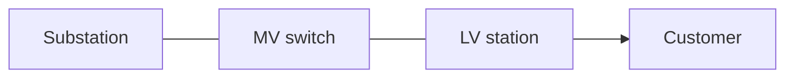
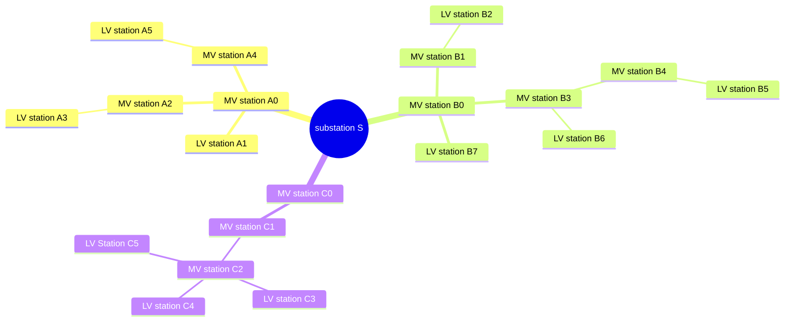

[[./Copyright and Usage|previous]] [[./Graph Theory - History and Context|next]]
# Introduction

The NetCon model and its logic have been created by Spatial Eye to **reason about networks** and provide **a single source of truth for network information** in the organisation. Networks can be electricity, gas, water, heat, sewage or telecom networks, or other commodities that can be transported.

![[../Zimages/example_electricty_network.png|example_electricty_network.png]]

Examples of reasoning about a network include:
- **Digital twin:** continuous calculations to track the current state of the network and simulate new states;
- **Advanced Distribution Management System (ADMS):** daily operation of the grid;
- **Outage Management System:** monitoring, fault diagnosis and service restoration.

## Topology and graph theory basics

Topology focuses on how things are connected, not on precise distances or geometry. In network terms, topology describes connectivity and can be viewed as:
- **Physical topology:** the real-world connectivity of assets.
- **Logical topology:** a schematic or operational view used for reasoning and analysis.

Graph theory is the mathematical foundation for this connectivity. A graph is `G = (V, E)`, where `V` is a set of vertices (nodes) and `E` is a set of edges (links). Edges can be directed or undirected and may carry weights such as distance, cost or capacity.

NetCon models networks as a property graph where edges are represented as **connections** and endpoints are **nodes**. The rest of this guide uses "connectivity" to describe the topology. See [[../3 Overview/3.5 Commodity Networks/Network Ontology|Network Ontology]] for NetCon-specific terminology and [[../4 Getting started/Property Graph - Introduction|Property Graph - Introduction]] for how properties are modeled.

For historical background and context, see [[./Graph Theory - History and Context|next]]. For common network layouts by domain, see [[./Network Topology Types|Network Topology Types]].

### Example graph with vertices and edges

### Vertices

Vertices are the nodes of the network. For example the table here below.

| Vertex | Description |
| --- | --- |
| A | Substation |
| B | MV switch |
| C | LV station |
| D | Customer |

Edges are the links of the network. For example the table here below.

| Edge | From | To | Directed |
| --- | --- | --- | --- |
| e1 | A | B | No |
| e2 | B | C | No |
| e3 | C | D | Yes |

In NetCon, all asset references are modelled NetConConnections and they have a FromNodeId and ToNodeId.
NetConConnections model (part of) an asset, such as a SubStation, MV Switch, a Service Point, but also a Cable, Wire or Pipe.
Related items that are not conducting, such as a LV Station (aka distribution station) or a Customer, are linked to these NetConConnections via a AssetHierarchy.
This means nodes are not labeled as in the example above, but are just numbers, providing connectivity information which NetConConnection (or network element) connects to what.

Typically, networks are represented as graphs. The example below shows an undirected, radial (tree-like) graph. Meshed or ring topologies introduce cycles and multiple routes between nodes.

Please note that the text and programs in NetCon are protected by [[./Copyright and Usage|previous]].
