[[./Graph Theory - History and Context|previous]] [[../2 Version And Release Information/2.2 Version Information|next]]
# Network Topology Types

This page summarizes common network topology types and how they show up in real-world utility and infrastructure networks.

## Common topology types

- **Bus:** all nodes share a common backbone. [Bus network](https://en.wikipedia.org/wiki/Bus_network)
- **Ring:** each node connects to two neighbors, forming a loop. [Ring network](https://en.wikipedia.org/wiki/Ring_network)
- **Radial (Star):** nodes connect to a central hub or a main feeder with branches. [Star network](https://en.wikipedia.org/wiki/Star_network)
- **Extended star (Tree):** star-like branches with multiple levels. [Tree network](https://en.wikipedia.org/wiki/Tree_(graph_theory))
- **Hierarchical:** multiple tiers with aggregation at higher levels. Often implemented as a tree with local rings or meshes.
- **Mesh:** many nodes have multiple paths between them. [Mesh network](https://en.wikipedia.org/wiki/Mesh_networking)

In practice, networks are hybrids. You can mix a hierarchical backbone with meshed areas and radial feeders depending on reliability, cost, and operational needs.

## Examples by domain

- **Electricity:** typically hierarchical with radial feeders (star-like) at distribution level, and meshed or ringed structures at higher voltage levels for redundancy.
- **Water:** dense urban areas historically used meshed networks for resilience. Rural areas are often radial. Many utilities are rebuilding toward more radial zones to improve self-cleansing and control.
- **Gas:** commonly ring-shaped in urban areas for resilience, with radial branches in low-density areas.
- **Telecom:** access networks are usually hierarchical and tree-shaped (for example PON). Backbone and metro networks are often ring or mesh. Traffic engineering often models links as directed for capacity and routing.
- **District heat:** typically radial with supply and return lines and limited meshing. Control valves and operating regimes can make flow effectively directed.
- **Roads:** graphs with strong locality and many cycles in cities. Direction is mixed; one-way streets are directed edges.
- **Railways:** often radial from hubs with ring or bypass lines in metros. Track direction and signaling can make segments effectively directed, even if the physical track is bidirectional.

## Direction and control

Water and gas networks are usually bidirectional in physical connectivity, but **control valves** can enforce direction. The same idea applies to heat networks (supply and return) and to electricity when switches or protection settings constrain flow. In telecom, physical links can be bidirectional, but routing and capacity planning are typically modeled as directed.

## Abstract examples
### Bus

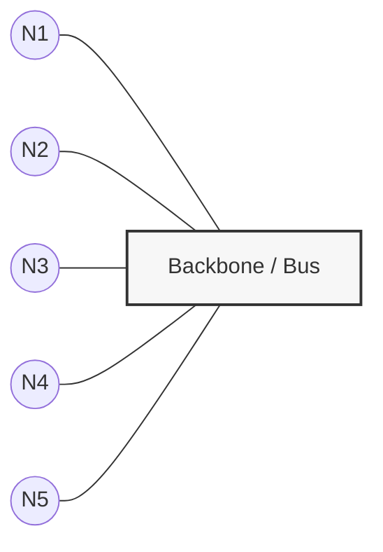

### Ring

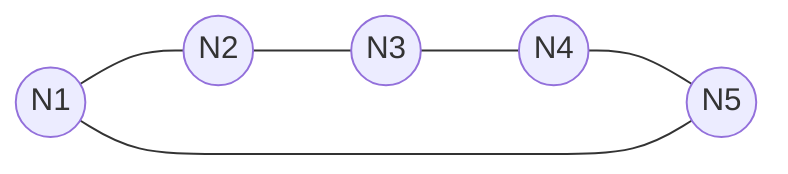

### Radial (Star)

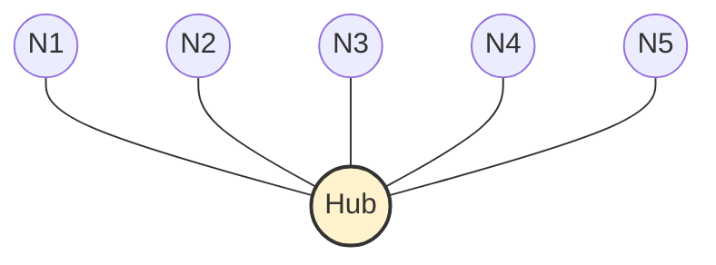

### Extended star (Tree)

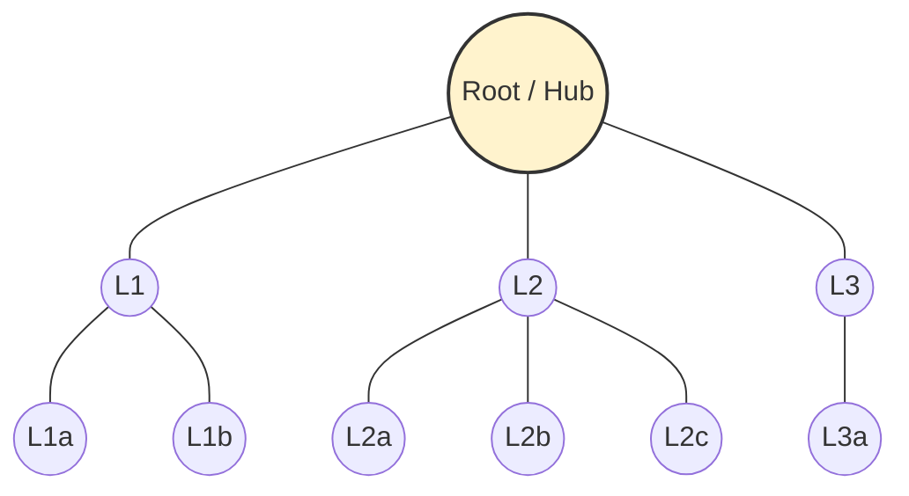

### Tree variant: “main feeder with branches”

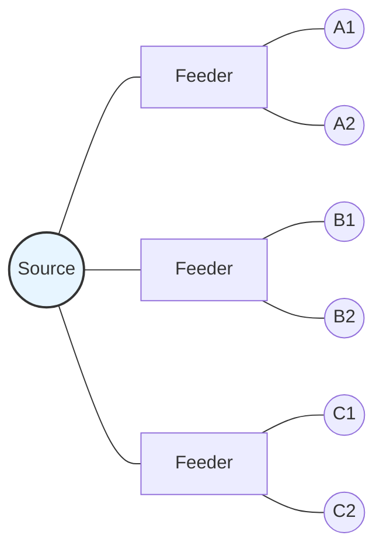

### Hierarchical (multi-tier; tree with local rings/meshes)

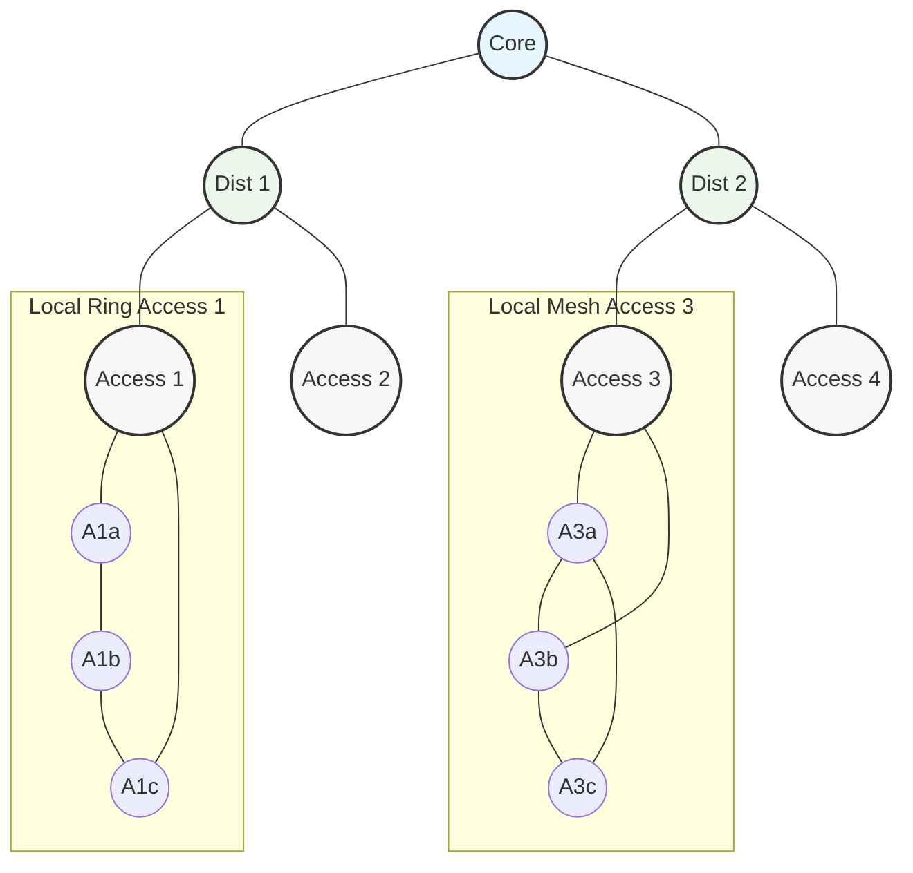

### Mesh

#### Full-ish mesh (small N)

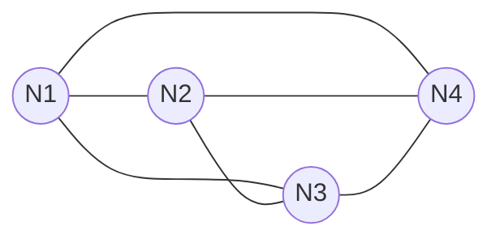

#### Partial mesh (more realistic)

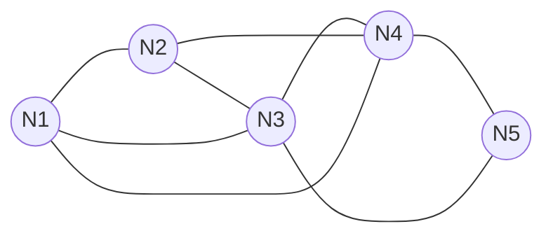

## Concrete examples

Some simplified descriptions of components used below:

* **Primary Substation** 
  Interface between the transmission (HV) network and the medium-voltage (MV) distribution network, providing voltage transformation, protection, and primary switching.

* **Busbar**
  Common electrical node within a substation that interconnects multiple feeders, breakers, and transformers at the same voltage level.

* **Main Feeder Trunk**
  The principal MV line segment that carries power outward from the substation before branching into laterals or secondary feeders.

* **MV Switching Node**
  A controllable MV connection point used to route, isolate, or reconfigure feeders, typically hosting switching and protection devices.

* **MV Aggregation**
  An intermediate MV level where multiple feeders or branches are collected, redistributed, or supplied from one or more upstream sources.

* **RMU (Ring Main Unit)**
  A compact, enclosed MV switchgear unit enabling safe switching, sectionalizing, and protection in ring or radial distribution networks.

* **Sectionalizer**
  A normally closed switching device used to isolate faulted sections of a feeder while keeping healthy sections energized.

* **CB (Circuit Breaker)**
  A protection device capable of interrupting fault currents and automatically disconnecting equipment under abnormal conditions.

* **TX (Distribution Transformer)**
  A transformer that steps voltage down from MV to LV to supply end users.

* **Line Segment**
  A physical section of conductor or cable connecting two network nodes, representing a continuous electrical path.

* **LV (Low Voltage)**
  The final distribution level supplying electricity directly to customers, typically downstream of distribution transformers.
### Power distribution examples

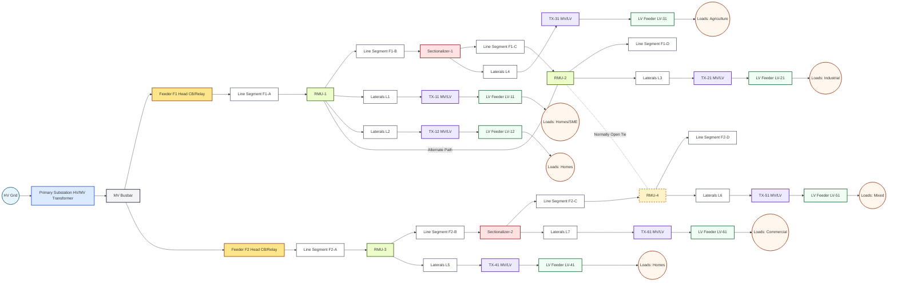

### Two outgoing points feeding a closed ring
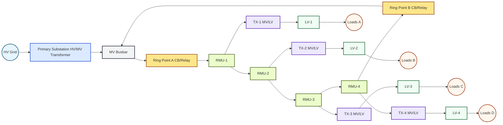

### Radial (Star) feeders

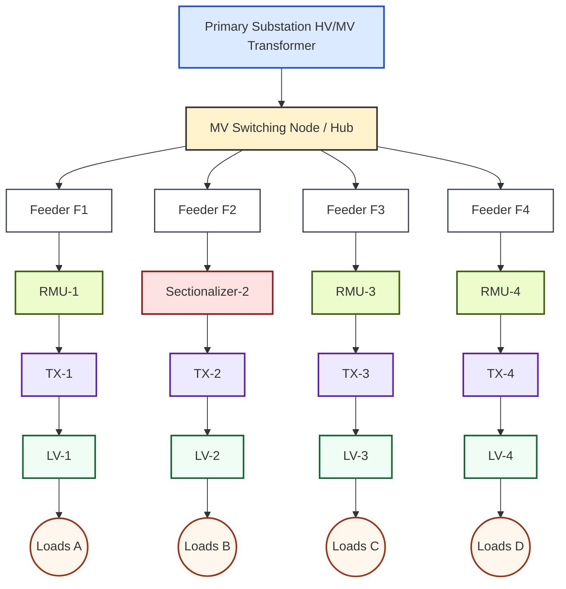

### Extended star (Tree)

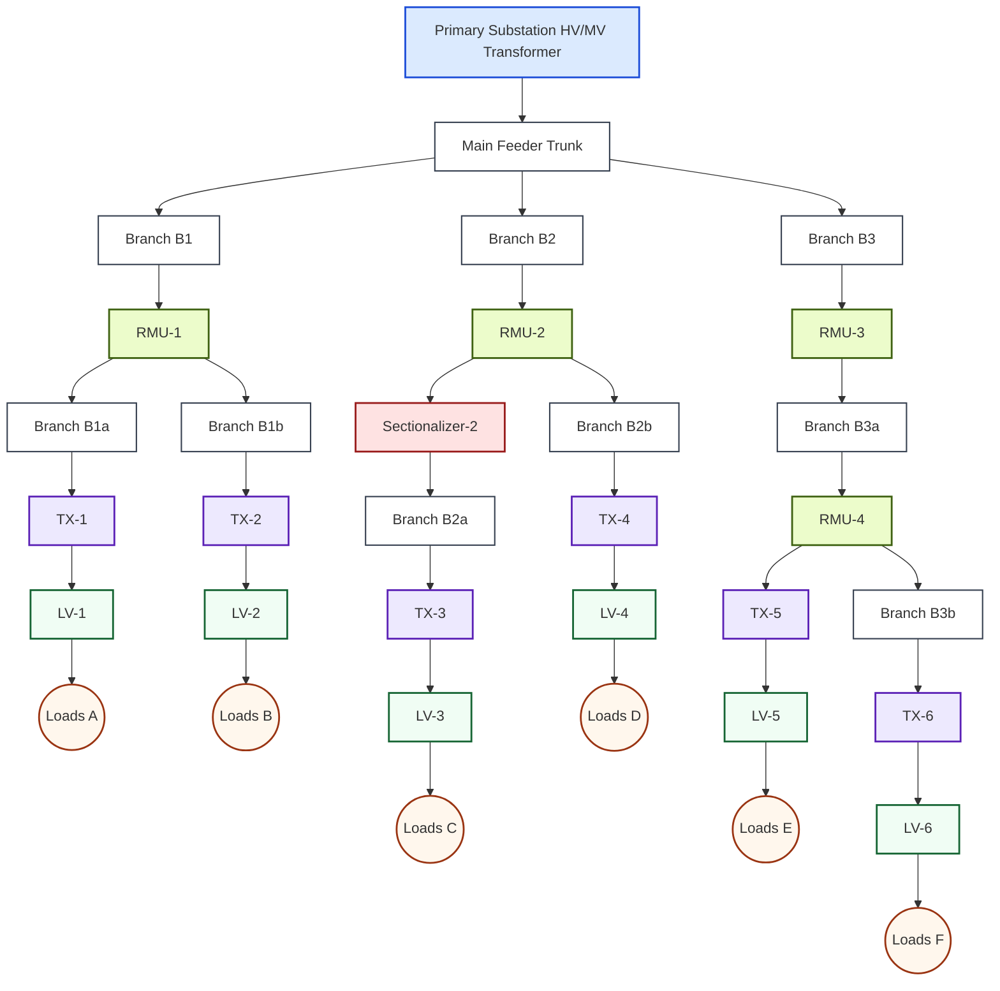

### Hierarchical (tiers + local rings/meshes)

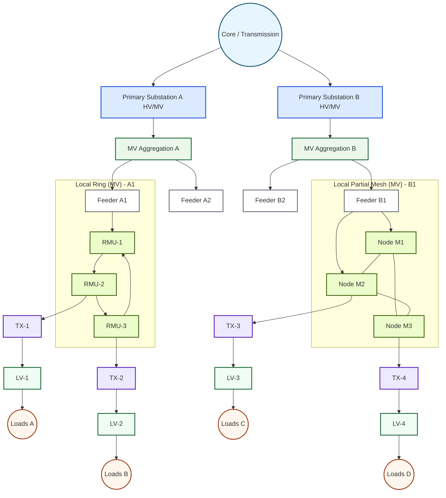

### Mesh (MV partial mesh with multiple alternative paths)

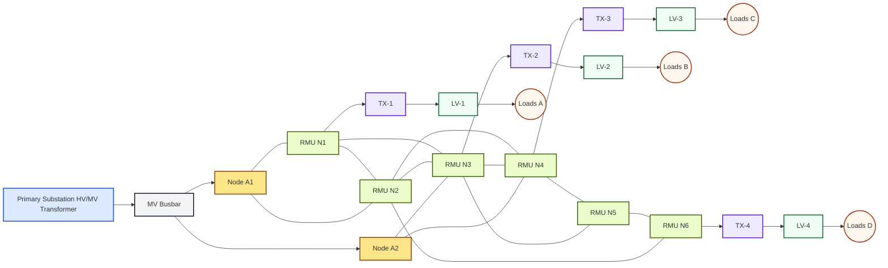
