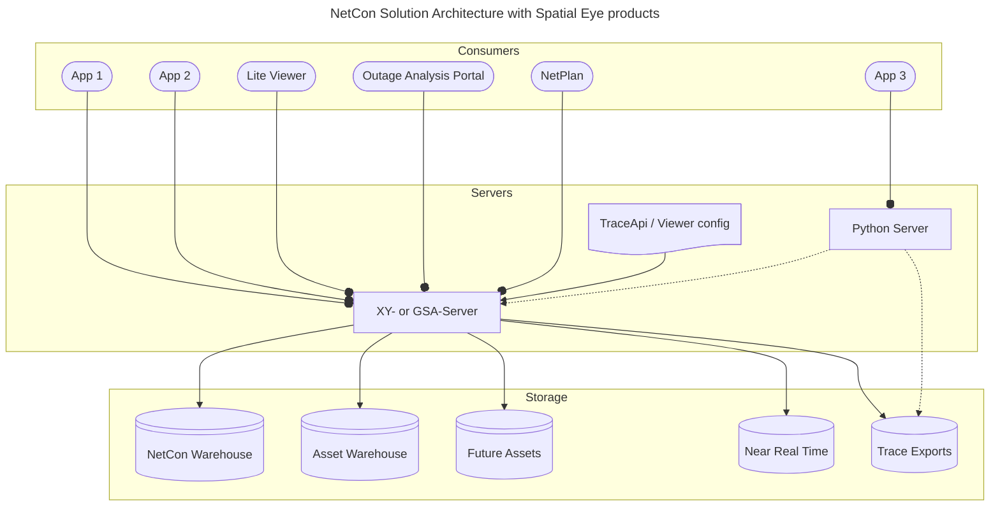

[[./3.2 Data Flow Examples/Overview Examples - 1. Purpose and Examples|previous]] [[./Overview - 4. Sources of Connectivity|next]]
# Solution Architecture

The different functions of NetCon are:

* Extracting connectivity (also known as topology);
* Storing connectivity in a universal and open format;
* Enable inspecting and improving connectivity data quality dynamically;
* Enabling enrichment of connectivity with all relevant information;
* Providing an expression language and API calls to query connectivity;
* Simplifying networks by reducing or morphing query results;
* Enabling viewing and using what-if scenario's.

NetCon is built into / on top of the Spatial Eye products' Solution architecture:

* A desktop tool for creating configuration, Spatial Analysis and BI;
* A server tool for hosting (spatial) processes, APIs, and viewing applications, amongst which;
	* A self-maintaining and repairing Warehouse for providing time aware repositories.
	* A network design tool for maintaining future a timeline and scenarios of the network.

Note that the usage of Warehouse as an batch mechanism providing extraction updates with high availability updates, will become optional in the future. For Small datasets, extraction can be done on the fly or by call exports tooling.