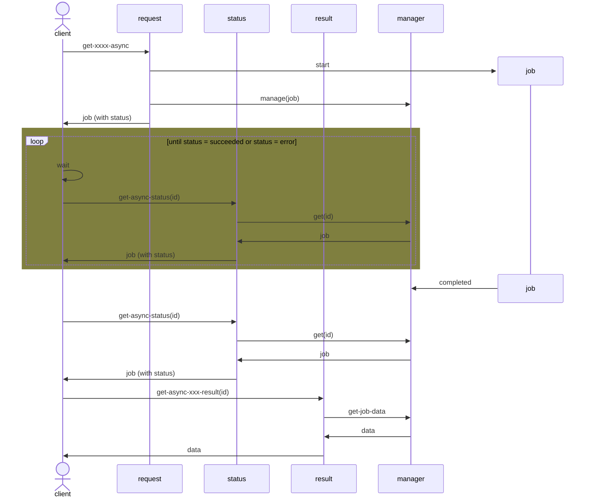

# Async NetCon API

 ## Overview

 The NetCon Async API uses an approach with 3 endpoints:
- Initiate job. For most "normal" (or synchronous) endpoints, there is an asynchronous (async) version available. The async endpoint address and parameters are the same as the synchronous version with '-async' appended, e.g. `trace-out` --> `trace-out-async`. See the synchronous endpoints for details.
- Get status. After a job has been initiated, the client application should poll the NetCon API to check the job status.
- Get data. After a job has completed, the client application gets the data from a data endpoint.

This process is described in the following sequence diagram:

## Endpoints

For most "normal" or synchronous endpoint, there is an asynchronous (async) version available. The async endpoint address is the same as the synchronous version with '-async' appended, e.g. `trace-out` --> `trace-out-async`.

### Request Endpoints

The async request endpoints have identical parameters as their synchronous counterparts. See them for parameters.

The async request endpoints start a job which will run on the server independent from the client. The endpoint will "immediately" return the job ID, which the client should keep to request job status, and when the job has completed, to retrieve the result.

### Status Endpoint

The endpoint `<baseUrl>/get-async-status` provides information about the job being executed. A GET on this endpoint returns the job status, and (when finished) the URL for the data result.

After an initial async call, this endpoint should be polled to check the job status. The client should use a delay between calls to prevent the server and the network to become flooded. An interval of at least 5 seconds is preferred.

#### Status request parameters

| name | location | type | value |
| ---- | -------- | ---- | ----- |
| Id | Query parameter | Guid | The job ID returned from the async request |

#### Status response

The response is in JSON format, and contains the following elements:

| name             | type               | value                                                                                                                                                                                                                   |
| ---------------- | ------------------ | ----------------------------------------------------------------------------------------------------------------------------------------------------------------------------------------------------------------------- |
| Id               | Guid               | The job ID                                                                                                                                                                                                              |
| Status           | string             | The job status. See below for details.                                                                                                                                                                                  |
| Error            | string             | A textual representation of any error(s) that have occured                                                                                                                                                              |
| CreatedUtc       | datetime           | When the job was created                                                                                                                                                                                                |
| StartedUtc       | datetime, optional | When the job started execution                                                                                                                                                                                          |
| FinishedUtc      | datetime, optional | When the job finished execution                                                                                                                                                                                         |
| Attempts         | int                | The number of attempts                                                                                                                                                                                                  |
| ExpiresInSeconds | int                | Seconds until record expiry (best-effort)                                                                                                                                                                               |
| ResultUrl        | string, optional   | If the job has finished successfully, this URL is of the data endpoint where the job result can be retrieved. Note that the data is only available for a (short) period of time, configurable on the NetCon Api server. |

The status element can have the following values:

| name      | value | description                                              |
| --------- | ----- | -------------------------------------------------------- |
| Canceled  | -2    | The job was cancelled                                    |
| Failed    | -1    | The job ended in error                                   |
| Initial   | 0     | The job is created                                       |
| Queued    | 1     | The job is queued and waiting to run                     |
| Running   | 2     | The job is running (not yet completed)                   |
| Succeeded | 3     | The job has finished without errors, and is now complete |

### Data Endpoint

This endpoint is used to download the result of the async job. The data is only available after the job has completed successfully. There are several endpoints matching the type of data the job produced. Initially, these endpoints are available:

- `get-async-query-result` - Get standard NetCon query data, i.e. NetConConnections.
- `get-async-data-quality-result`- Get the Data Quality data.

See the corresponding synchronous endpoint documentation for details.

#### Data request parameters

All requests to all async data endpoints have 1 parameter, identical to the job status request:

| name | location | type | value |
| ---- | -------- | ---- | ----- |
| Id | Query parameter | Guid | The job ID returned from the async request |

#### Data response

The response depends on the async request that started the job. See the synchronous endpoints documentation for details.
